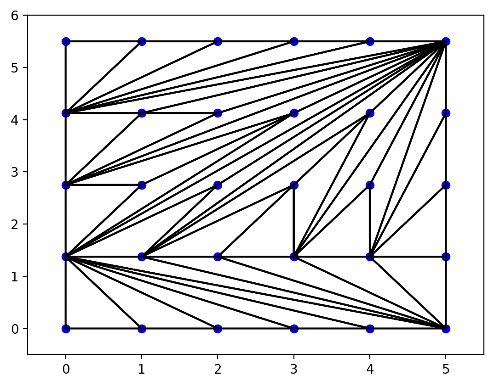
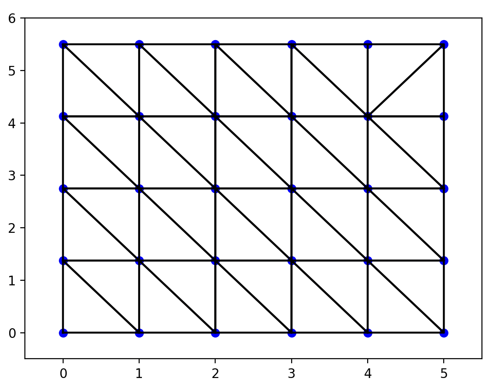
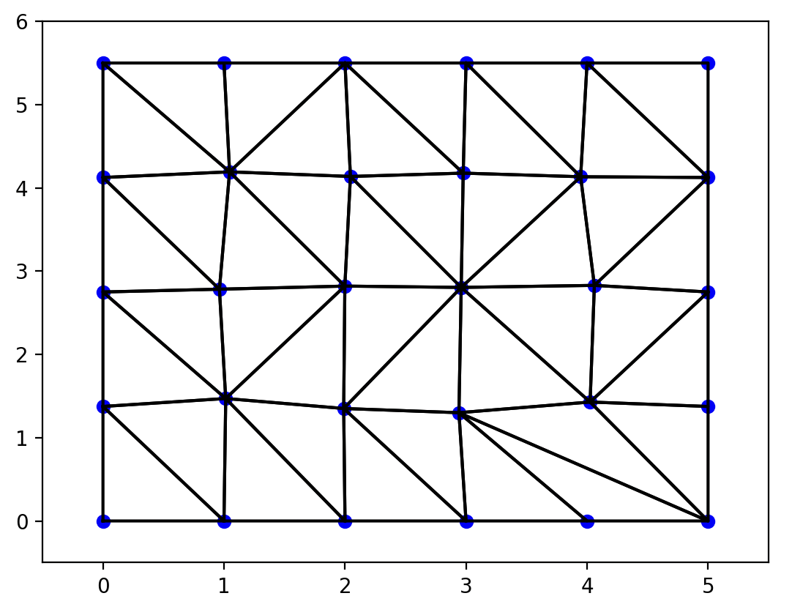

# Mesh Generator

## Summary

A C++ program that generates 2D triangular meshes for finite element analysis. The program takes a rectangular surface description and generates mesh nodes and triangular elements through four progressive steps: basic node generation, simple triangulation, Delaunay triangulation, and randomized mesh improvement.

## Building and Running

### Build the Program
```bash
make all
```

### Run Individual Steps
```bash
# Step 1: Generate nodes
./build/mesh-generator --step1 inputs/simple-mesh.txt

# Step 2: Simple triangulation  
./build/mesh-generator --step2 inputs/simple-mesh.txt

# Step 3: Delaunay triangulation
./build/mesh-generator --step3 inputs/simple-mesh.txt

# Step 4: Randomized mesh improvement
./build/mesh-generator --step4 inputs/simple-mesh.txt
```

### Test All Steps
```bash
make test-all
```

## What Each Step Does

### Step 1: Node Generation
Reads the input file and generates mesh nodes at regular intervals within the rectangular surface, ensuring node spacing does not exceed the specified maximum element sizes.

### Step 2: Simple Triangulation
Performs basic triangulation by:
1. Adding rectangle vertices to form the boundary
2. Sorting remaining nodes by coordinates
3. Connecting each new node to vertices of its enclosing triangle



### Step 3: Delaunay Triangulation
Improves triangulation quality using the Delaunay criterion - ensures no mesh point lies within the circumcircle of any triangle. This maximizes minimum interior angles and creates more uniform elements.



### Step 4: Randomized Mesh Improvement
Adds controlled randomness to node placement while preserving the total number of nodes, creating more varied mesh patterns suitable for different applications.



## Plotting Generated Meshes

To visualize the output mesh, use the provided plotting script:

```bash
python scripts/plot.py output.txt
```

The plotting script requires matplotlib and numpy.

## Input File Format

The input file describes a rectangular surface with the following structure:

```
1.0     # Maximum x-element size
1.5     # Maximum y-element size  
0.0 0.0 # Bottom-left vertex (x, y)
5.0 0.0 # Bottom-right vertex (x, y)
0.0 5.5 # Top-left vertex (x, y) 
5.0 5.5 # Top-right vertex (x, y)
```

- Line 1: Maximum allowed element size in x-direction
- Line 2: Maximum allowed element size in y-direction
- Lines 3-6: Four corner vertices defining the rectangular surface (x, y coordinates)

## Algorithm Reference

The Delaunay triangulation algorithm is based on:
Lee, D.T. and Schachter, B.J. "Two algorithms for constructing a Delaunay triangulation." International Journal of Computer & Information Sciences 9, 219-242 (1980). https://link.springer.com/article/10.1007%2FBF00977785